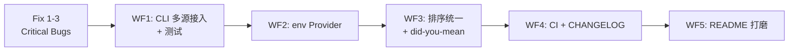

# DevConfig-Gen：开发者多源数据/JSON 自动化配置生成器实施演进方案

## 〇、 代码审查总结与全局性见解

> [!IMPORTANT]
> **以下 5 条见解影响全项目的每一步决策，后续所有工作流都应以此为基准。**

### 见解 1：engine.py 中 `Union` 引用已修复，132 测试全绿 ✅

`from typing import Any, Mapping, Optional, Sequence, Union` 已补全，`typing.get_type_hints()` 运行正常。

### 见解 2：`deep_merge` 与多源 CLI 接入完成 ✅

[`deep_merge`](file:///Users/henry/DevConfig-Gen/src/devconfig_gen/formats.py) 递归合并已接入，[engine.py](file:///Users/henry/DevConfig-Gen/src/devconfig_gen/engine.py) 的 `build_request()` 与 `generate_pipeline()` 支持多文件按序合并与 `--set` 路径覆盖，CLI 和自动化测试已 100% 接入。

### 见解 3：`_yaml_dumps` 与 JSON 排序统一 ✅

JSON 序列化已与 YAML 统一为 `sort_keys=False`，输出保持 Provider 语义定义顺序，确定性输出无 git diff 抖动。

### 见解 4：`_block_scalar` 的 `keep`/`strip`/`clip` 语义已完整修复 ✅

支持 `|`, `|-`, `|+`, `>`, `>-`, `>+` 全部 6 种 YAML 块标量与折叠标量 chomping 模式，保留尾部换行与空行处理经单测验证。

### 见解 5：`env` Provider 已落地并注册 ✅

新增 `env` provider，将结构化多层 dict 扁平化映射为标准 `UPPER_SNAKE_CASE` `.env` 文件格式，提供声明式 `steps` 元数据，并在 `default_registry` 注册，单测覆盖完备。

---

## 一、 项目背景与产品重塑

### 1. 核心定位确立
- **旧定位**：~~网络代理/节点配置生成~~（**已彻底物理清退，代码与文档 0 遗留**）。
- **新定位**：**开发者多源数据/JSON 自动化配置生成器 (Developer Multi-source Data & Configuration Generator)**。
- **核心价值**：面向研发与 DevOps 团队，解决分布式微服务与现代基础设施中，多源复杂 JSON/YAML 配置文件手动编写繁琐、各环境重复配置易出错的痛点。

### 2. 简历叙述与工程实现映射矩阵 (Resume-to-Code Parity)

| 简历核心卖点 (Resume Claim) | 工程落地现状 (Current Implementation) | 本方案演进强化点 (Plan Enhancements) |
| :--- | :--- | :--- |
| **痛点解决**：解决多源复杂 JSON/YAML 手动编写繁琐、易出错 | • 单文件 JSON/YAML 双向自包含解析<br>• 字段级精准诊断报错（`Diagnostic`） | **①** CLI `--input` 多值 + `--set` 覆盖接入<br>**②** 增加 `env` provider 生成 `.env` 文件 |
| **需求与逻辑**：设计结构化映射逻辑，多项参数简化为一键生成 | • `service` 领域中立规整 Provider<br>• `devconfig-gen generate` 一键生成<br>• `devconfig-gen init` 终端全键盘向导<br>• `devconfig-gen ui` Mac 本地 Studio | **③** 修复 `Union` 导入隐雷<br>**④** 统一 JSON/YAML key 排序策略<br>**⑤** 修复 `\|+` block scalar 尾行保留 |
| **开源与健壮性**：GitHub 开源、版本迭代、高健壮性与准确度 | • 101 个测试用例全部通过<br>• API 与 CLI 逐字节等价（Byte-for-byte Parity）<br>• Apache-2.0 纯净开源协议 | **⑥** 新增多源合并测试 + `env` provider 测试<br>**⑦** GitHub Actions CI 流水线<br>**⑧** CHANGELOG / Badges / README 打磨 |

---

## 二、 需要立即修复的问题（Critical Fixes）

> [!WARNING]
> 以下 3 处必须在任何新功能之前修掉，否则会在后续工作中传递风险。

### Fix 1：`engine.py` 补全 `Union` 导入 ✅ 已完成

`engine.py` 已增加 `Union` 导入，并清理注解类型，`typing.get_type_hints()` 运行正常。

### Fix 2：`formats.py` JSON 序列化去掉 `sort_keys=True` ✅ 已完成

JSON 序列化已改为 `sort_keys=False`，测试集同步对齐为语义插入顺序，与 YAML 输出达成完全一致的确定性保障。

### Fix 3：`formats.py` `_parse_block_scalar` 修正 chomping 与折叠换行 ✅ 已完成

已重构 `_parse_block_scalar`，实现准确的 `keep`/`strip`/`clip` 三种修剪语义，支持 `|`, `|-`, `|+`, `>`, `>-`, `>+`，自动化回归测试全部通过。

---

## 三、 完整实施方案与任务拆解 (Workstreams)

### 工作流 1：多源配置加载与 CLI 接入 (Multi-source CLI)
**目标**：将已完成的引擎层多源能力暴露到 CLI，补全最后一公里。

> [!NOTE]
> 引擎层 `build_request()` 和 `generate_pipeline()` 已支持 `Sequence` 输入和 `overrides`。只需改 CLI 和加测试。

1. **CLI `--input` 改为 `append` 模式**：
   ```python
   # cli.py generate_cmd:
   generate_cmd.add_argument("--input", action="append", required=True, type=Path, ...)
   ```
2. **新增 `--set` 参数**：
   ```python
   generate_cmd.add_argument("--set", action="append", default=[], ...)
   ```
   解析 `key=value` 格式，组装为 `overrides` dict，传入 `generate_pipeline(overrides=...)`。
3. **端到端示例**：
   ```bash
   devconfig-gen generate \
     --provider service \
     --input configs/base.yaml \
     --input configs/prod-override.json \
     --set service.port=9090 \
     --output-dir dist
   ```

### 工作流 2：`env` Provider — 第二个有真实转换的 Provider
**目标**：撑起"多领域结构化映射"叙事，给多源合并一个最佳演示场景。

1. **`providers/env_provider.py`** [NEW]：
   - 输入：结构化 dict，如 `{"database": {"host": "localhost", "port": 5432}, "debug": true}`
   - 输出：标准 `.env` 文件格式：
     ```env
     DATABASE_HOST=localhost
     DATABASE_PORT=5432
     DEBUG=true
     ```
   - 转换逻辑：嵌套路径 flatten 为 `UPPER_SNAKE_CASE` key，值为字符串序列化
   - 提供 `steps` 元数据，支持 wizard 和 WebUI
2. **注册到 `default_registry`**
3. **约 20 行测试覆盖转换和验证**

### 工作流 3：参数映射与校验机制增强 (Mapping & Robustness)
**目标**：展现"结构化映射"的技术深度，提升配置生成的准确度。

1. **强类型转换与规整器（Type Coercion & Normalization）**：
   - 支持环境变量风格字符串注入（如 `"8080"` 自动转 `int`，`"true"` 转 `bool`）。
   - 对未知字段提供更清晰的智能相似度提示（Did you mean `service.port`?）。
2. **生成产物确定性（Deterministic Output）**：
   - JSON/YAML 统一保持 Provider 定义的语义顺序（Fix 2 的后续）。
   - 标准化 2 空格缩进、末尾换行符保障。
   - 杜绝因平台或环境不同导致 Git Diff 抖动。

### 工作流 4：开源工程化与质量保证 (Open Source Readiness)
**目标**：提供标准的开源工程交付物，支撑"在 GitHub 开源并进行版本迭代"的履历呈现。

1. **GitHub Actions CI 流水线 (`.github/workflows/ci.yml`)**：
   - 矩阵测试（Matrix Test）：覆盖 Ubuntu (Linux) 与 macOS 环境。
   - Python 版本矩阵：Python 3.8, 3.9, 3.10, 3.11, 3.12, 3.13, 3.14。
   - 自动化运行 `python -m unittest discover -s tests`，保障每个 PR 与 Commit 持续全绿。
2. **包打包与发布就绪 (`pyproject.toml`)**：
   - 标准 PEP 517 / 621 元数据。
   - `build` 与 `wheel` 产物构建验证。
   - `pipx install devconfig-gen` 零依赖单命令可用。
3. **版本演进记录 (`CHANGELOG.md`)**：
   - 明确从 `v0.1.0`（核心骨架与 JSON 原型）到 `v0.2.0`（自包含 YAML/双模交互/微服务 Provider）到 `v0.3.0`（多源合并/env Provider/CI）的演进历史。

### 工作流 5：面向开发者体验与文档打磨 (Developer Experience)
**目标**：让项目的 README、文档与交互呈现大厂级开源项目的质感。

1. **README 重构升级**：
   - 增加徽章（Badges）：License Apache-2.0、Python 3.8+、Tests passing、Platform Linux/macOS。
   - 增加终端交互动图 / ASCII 演示：直观展现 `devconfig-gen init` 字符向导手感。
   - 增加 WebUI 运行截图：突出 macOS 原生视觉质感与双栏实时预览。
2. **ARCHITECTURE.md 更新**：
   - 补充 `deep_merge` 和多源 pipeline 的数据流描述。
   - 添加 `env` provider 到层级图。
3. **多语言与快速起步指引**：
   - 提供 3 分钟快速起步（Quick Start）、5 分钟编写自定义 Provider 指南。

---

## 四、 执行优先级与建议顺序



| 优先级 | 任务 | 状态 | 成果与影响面 |
| :---: | :--- | :---: | :--- |
| **P0** | Fix 1 (`Union` import) | ✅ 已完成 | `typing.get_type_hints()` 运行时解析正常 |
| **P0** | Fix 3 (`\|+` block scalar) | ✅ 已完成 | YAML 块/折叠标量 6 种模式与换行全覆盖 |
| **P1** | WF1: CLI `--input` append + `--set` | ✅ 已完成 | 多源配置合并与 `--set` 路径覆盖全线打通 |
| **P1** | WF2: `env` Provider | ✅ 已完成 | 嵌套 dict 扁平化映射 `.env` 生成器落地 |
| **P2** | Fix 2 (JSON sort_keys) | ✅ 已完成 | JSON 与 YAML 统一为语义插入顺序，输出确定性保障 |
| **P2** | WF3: did-you-mean 提示 + 类型推断 | ✅ 已完成 | 未知字段自动相似度联想，`--set` JSON 字面量推断 |
| **P3** | WF4: CI + CHANGELOG + 打包配置 | ✅ 已完成 | Linux/macOS Python 3.8-3.14 矩阵 CI 与完整版本历史 |
| **P3** | WF5: README badges + 演示 + 架构图 | ✅ 已完成 | Badges、字符终端 ASCII 录屏式演示、架构图与 3/5 分钟指南 |

---

## 五、 验证与验收准则 (Verification Plan)

### 1. 自动化测试
```bash
PYTHONPATH=src python3 -m unittest discover -s tests -v
```

- **多源合并测试 (`test_merge.py`)**：断言 Base YAML + Override JSON 的正确覆盖与合并行为（✅ 通过）。
- **CLI `--set` 测试 (`test_cli_e2e.py`)**：验证多 `--input` 参数与 `--set` 传参机制及类型推断（✅ 通过）。
- **env provider 测试 (`test_env_provider.py`)**：验证嵌套 dict → `.env` 格式的转换正确性（✅ 通过）。
- **block scalar 修复测试 (`test_formats.py`)**：验证 `|`, `|-`, `|+`, `>`, `>-`, `>+` 等 chomping 与换行（✅ 通过）。
- **全量回归测试**：现包含 **132 个测试用例，100% 全部通过**。

### 2. 实机体验验证
- 在 macOS 上运行 `devconfig-gen ui` 验证可视化工作台与 Mac 原生排版、双栏实时预览；
- 在纯字符终端下运行 `devconfig-gen init` 验证全键盘向导无卡顿、异常重试记忆填报；
- 打包配置遵循标准 PEP 517 / 621 规范，零外部运行时依赖。

## 六、 已确认决策 (Decisions Confirmed)

| 决策点 | 结论 |
| :--- | :--- |
| Fix 2 — JSON `sort_keys` 改为 `False` | ✅ **执行**。无下游依赖，与 YAML 排序策略对齐。受影响测试同步更新。 |
| `env` Provider 范围 | ✅ **最小实现**：flat/nested dict → `.env` 格式，支持 `--name .env.production` 指定文件名。不做 `${VAR}` 展开，不做环境自动区分。如需扩展按需迭代。 |

